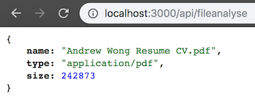
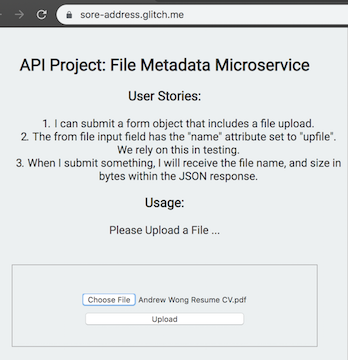
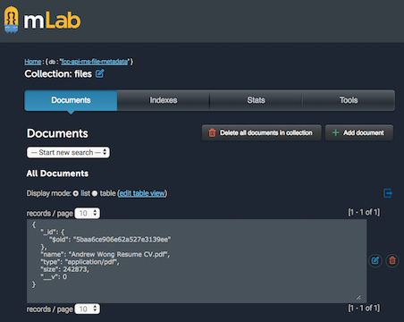

# API Project: File Metadata Microservice for freeCodeCamp - Completed

## Endpoints created:

POST /api/fileanalyse

 

## To run this project locally

1. Https or SSH download this project.
2. `npm install`
3. [Critical] Populate process.env.MONGOLAB_URI with your mongoDB URI from mLab
4. Navigate to localhost:3000/

### User stories:

1. I can submit a form that includes a file upload.
2. The from file input field has the "name" attribute set to "upfile". We rely on this in testing.
3. When I submit something, I will receive the file name and size in bytes within the JSON response

### Usage :

- Go to the main page, and upload a file using the provided form.

### Hint:

- To handle the file uploading you should use the [multer](https://www.npmjs.com/package/multer) npm package.
